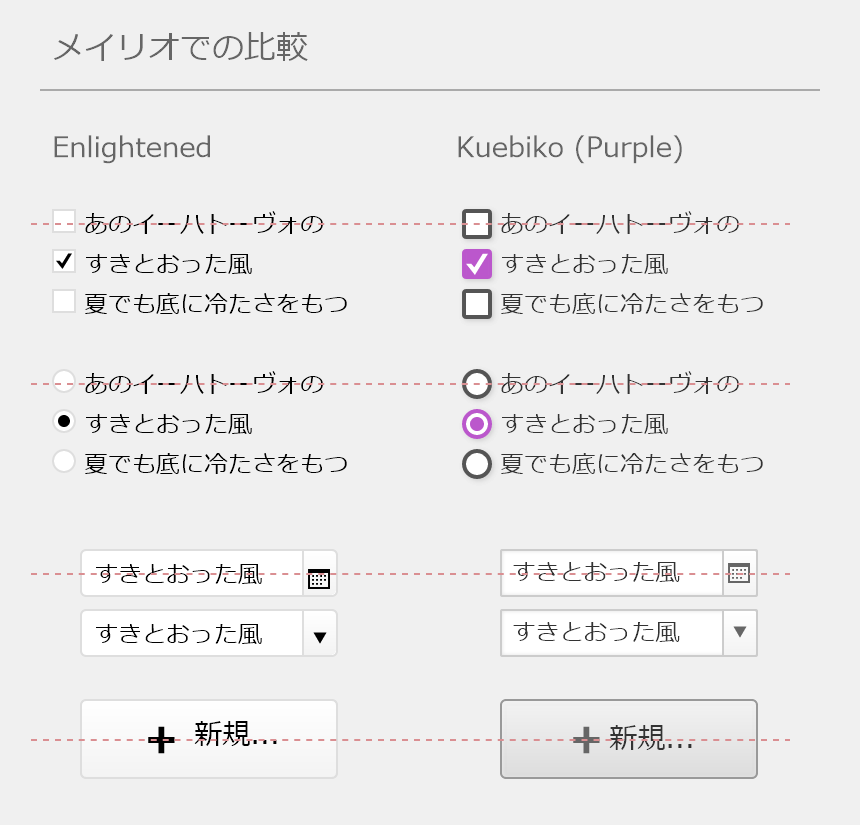
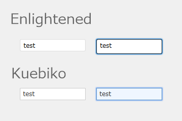

Kuebiko - FileMaker Theme
====

「クエビコ」は FileMaker Pro ver14 以降 の日本語用テーマです。
日本語の Windows 環境に特化した、汎用性のあるノーマル（無個性な）スタイルです。
スターターとして使える事を目的にしています。


## Description

ビルドインテーマのフォントをメイリオにした時に発生する、インスペクタでは直しようがないスタイルの崩れを解消できます。
例えば...


※アイコンと文字は中央揃えにノーマライズします。


※インプットボックスにフォーカスした際だけ、ボックス高さが下に延びる事象を防ぎます。
※レイアウトモードでのテキストオブジェクトの打ちかえにおいて、フォーカス時にテキストボックス高さが下に延びる事象を防ぎます。


また、色相のバリエーション（34色）を含み、それらに互換性があるので、テーマのカラートーンの適応後の一括変更が容易です。


※ ウェブダイレクト公開ではスタイルが崩れます。悪しからず。

## リポジトリ内のファイル構成

Themes フォルダ以外は、作成ツールですので、実動作には必要ありません。

```
リポジトリ root
│
├ SAMPLE.fmp12 ... 当該テーマを確認できるサンプルの FileMaker Pro ファイル
├ README.md ... 当該の説明ファイル
│
├ manifest.xsl ... manifest.xml を生成する xslt スタイルシート
├ manifest.vbs ... 上記の xslt を実行するスクリプト
│
├ extra.less ... extra.css 用 less テンプレートファイル
│
└ Themes ... テーマ定義ファイル群（中身を同名のフォルダに移動してください）
   │
   ├ kuebiko_00Gray
   │  ├ styles ... 当該テーマの各色バリエーション間で共用する css ファイル群
   │  │  ├ part.css
   │  │  ├ figure.css
   │  │  ├ text.css
   │  │  ├ field.css
   │  │  └ control.css
   │  │
   │  ├ manifest.xml
   │  ├ extra.css
   │  └ preview.png
   │
   ├ kuebiko_01Brown
   │  ├ manifest.xml
   │  ├ extra.css
   │  └ preview.png
   │  ～
   └ kuebiko_24Tomato
      ├ manifest.xml
      ├ extra.css
      └ preview.png
```


## Requirement
FileMaker Pro ver12 以降が必要です。
すべての機能やサンプルの fmp12 ファイルを使うには FileMaker Pro ver14 以降が必要です（ボタンバーなどの新しいレイアウトオブジェクト用のスタイルが定義されているので）。

※ ウェブダイレクト公開ではスタイルが崩れます、悪しからず。


## Install & Usage
FileMaker Path 直下の Themes フォルダ内に、同梱の Themes フォルダ内のすべてのフォルダを入れてください。
例) C:\Program Files\FileMaker\FileMaker Pro 14 Advanced\Themes

FileMaker Pro を再起動する必要はなく、すぐにレイアウトに当テーマを割り当てることができるようになります。


## Author
[Yasuhiro Tambara](https://github.com/YasuhiroTambara)
